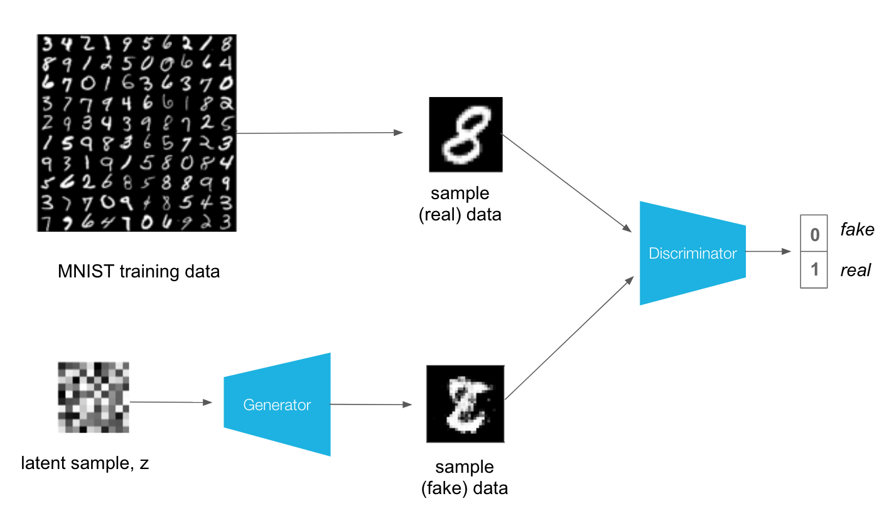
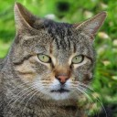
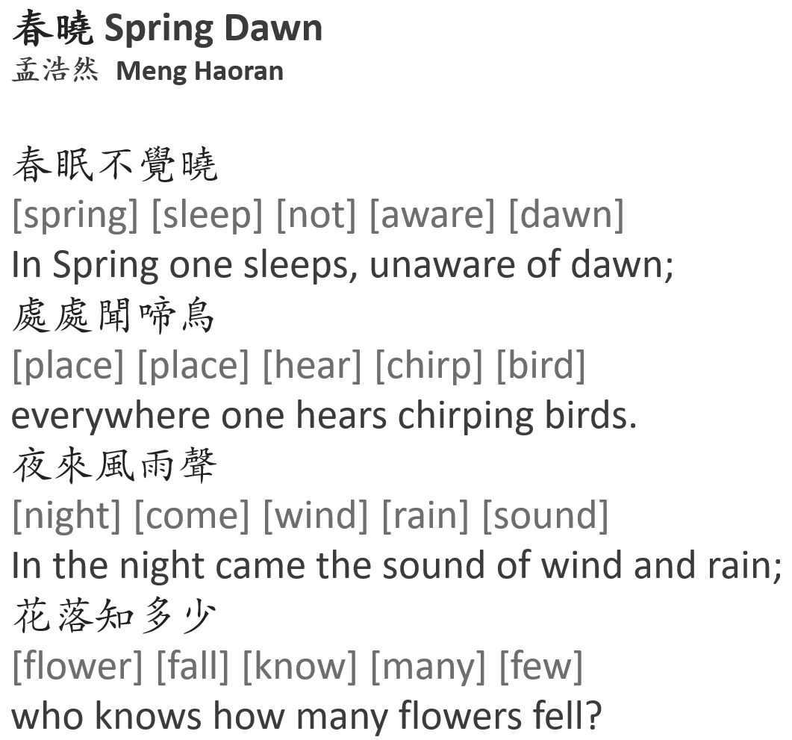

# Classical Chinese Quatrain Generation
#### Sean Y. Li
## Introduction: GANs

A Generative Adversarial Network (GAN) is a type of neural network whose two main components, the generator and discrminator, are at odds with each other. Generators works similarly to autoencoders and also like the decompression part of compression algorithms for things like Winrar (Did you pay for your license?) or zip files. Except instead of decompressing a compressed file, it generates something random because the algorithm was used on random noise. For the MNIST dataset often used in simple GAN demonstrations, the process would be taking random noise and outputting a matrix of 28x28. The discriminator is more simple, binary classification neural network, tasked with determining whether the data is real or fake. With each loop, the generator will change its weights and try to generate images to fool the discriminator. The discriminator, which increasingly has a harder time telling the difference between real and fake images and also adjusts its weights, pitting the two networks against each other. Thus the combination is called an “adversarial” network. 

   

  
https://thiscatdoesnotexist.com/

With enough training, a GAN can generate very realistic looking data/images. The cats on the right were all made through a GAN. While the background of the last picture seems a little distorted, the cats themselves are indistinguishable to pictures of real cats.

## Background: Quatrains
Classical Chinese *juéjù* 絕句 or [quatrains](https://en.wikipedia.org/wiki/Jueju) have either five or seven syllable

## Problem Statements

one type of meter structure
### Data Source, Formatting, and Cleaning

### Dictionary Building

### Modeling

## Next Steps

#### Sources
* [Chinese Poetry Github Repository](https://github.com/chinese-poetry/chinese-poetry)
* [Online Rime Dictionary Database](https://ytenx.org/)

