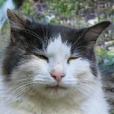

# Classical Chinese Quatrain Generation
#### Sean Y. Li
## Introduction: GANs

A Generative Adversarial Network (GAN) is a type of neural network whose two main components, the generator and discrminator, are at odds with each other. Generators works similarly to autoencoders and also like the decompression part of compression algorithms for things like Winrar (Did you pay for your license?) or zip files. Except instead of decompressing a compressed file, it generates something random because the algorithm was used on random noise. For the MNIST dataset often used in simple GAN demonstrations, the process would be taking random noise and outputting a matrix of 28x28. The discriminator is more simple, binary classification neural network, tasked with determining whether the data is real or fake. With each loop, the generator will change its weights and try to generate images to fool the discriminator. The discriminator, which increasingly has a harder time telling the difference between real and fake images and also adjusts its weights, pitting the two networks against each other. Thus the combination is called an “adversarial” network. 

   

  
https://thiscatdoesnotexist.com/

With enough training, a GAN can generate very realistic looking data/images. The cats on the right were all made through a GAN. While the background of the last picture seems a little distorted, the cats themselves are indistinguishable to pictures of real cats.

## Background: Quatrains
Classical Chinese *juéjù* 絕句 are [quatrains](https://en.wikipedia.org/wiki/Jueju) of either five or seven syllables popularized in the Tang dynasty. Below is an example of one of the more famous ones.

春曉 Spring Dawn
孟浩然 Meng Haoran

春眠不覺曉 [spring] [sleep] [not] [aware] [dawn]
\
處處聞啼鳥 [place] [place] [hear] [chirp] [bird]
\
夜來風雨聲 [night] [come] [wind] [rain] [sound]
\
花落知多少 [flower] [fall] [know] [many] [few]

In Spring one sleeps, unaware of dawn;
\
everywhere one hears chirping birds.
\
In the night came the sound of wind and rain;
\
who knows how many flowers fell?

You might think at this point, why try to use something that normally generates images to generate text? Well, if you look at it from another angle, these quatrains actually resemble images a lot. Take this comparison with the famous MNIST dataset that GAN demonstrations often use.

Quatrain Features:
* Set dimension (7x4 and 5x4)
* Finite character possibility (characters in training data)

MNIST Features:
* Set dimension (28x28)
* Finite pixel intensity (255)

The additional parameters of a strict meter format and rhyme scheme only give a discriminator more parameters to scrutinize the generators creations. In additon, the lack of inflection and loose word order in Chinese means the model doesn’t need to worry much about grammar of the output.

## Problem Statements
Using this framework I came up with 3 problem statements.
1. Can a GAN which is normally used to generate images of a fixed size, be used to generate poetry of a fixed size?
2. Can such a GAN learn meter constraints? 
3. Can such a GAN learn a rhyme scheme?

## Data
#### Character Metadata
| Key         | Example | Description                                                                                                       |
|-------------|--------:|-------------------------------------------------------------------------------------------------------------------|
| index       |    1003 | index of the character                                                                                            |
| char        |      地 | character                                                                                                         |
| tone        |      去 | [character tone](https://en.wikipedia.org/wiki/Four_tones_(Middle_Chinese)) (平: level tone 上: rising tone 去: departing tone 入: entering tone)                              |
| rime        |      至 | rime (character indicating same finals) from [_Guangyun_](https://en.wikipedia.org/wiki/Guangyun) rime dictionary                                           |
| ipa         |     dij | Middle Chinese reconstruction in [IPA](https://en.wikipedia.org/wiki/International_Phonetic_Alphabet)                                                 |
| tone_class  |       H | tone as letter (L: level tone, X: rising tone, H: departing tone, E: entering tone)                               |
| pinyin      |      dì | Pinyin romanization for modern Mandarin pronunciation                                                                                     |
| jyutping    |    dei6 | Jyutping romanization for modern Cantonese Pronunciation                                                                                    |
| hangul      |      지 | Modern Korean Pronunciation                                                                                       |
| rime_index  |       3 | index of major rime group                                                                                         |
| meter_class |       0 | Classical Chinese meter is determined by being either 1 for 平 level tone or 0 for 仄 oblique tone (all non-level tones)  |                                                                                 
#### Poem format
| additional for hepta- | pentasyllabic |   rhyme  |
|:---------------------:|:-------------:|:--------:|
|     ○○                |     ●●○○●     |          |
|     ●●                |     ○○●●○     |     ✓    |
|     ●●                |     ○○○●●     |          |
|     ○○                |     ●●●○○     |     ✓    |
### Data Source, Formatting, and Cleaning1

### Dictionary Building

### Modeling

## Next Steps

#### Sources
* [Chinese Poetry Github Repository](https://github.com/chinese-poetry/chinese-poetry)
* [Online Rime Dictionary Database](https://ytenx.org/)

